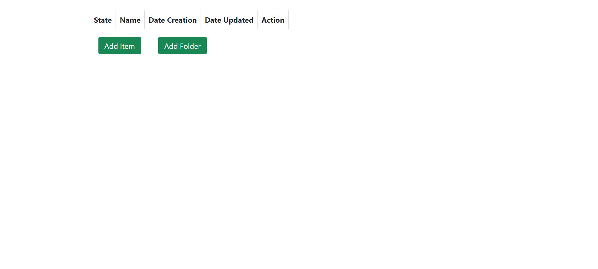
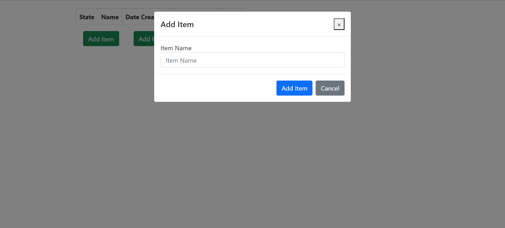
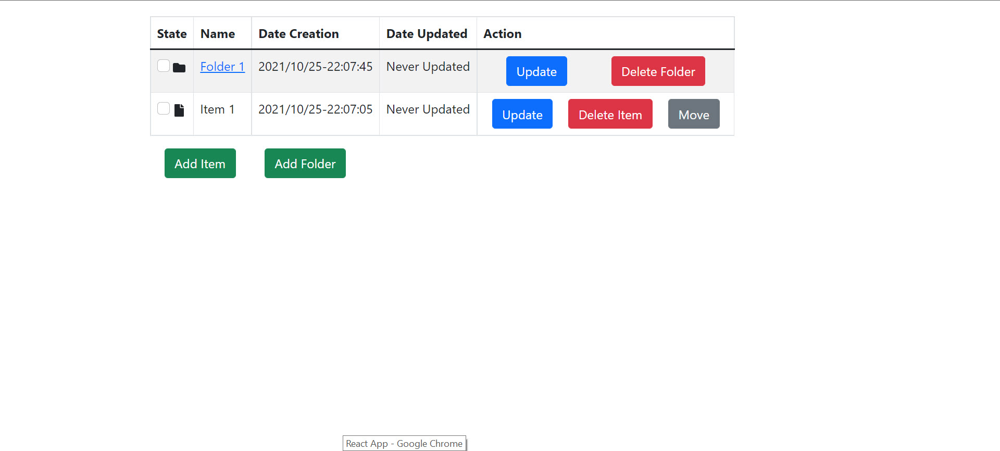
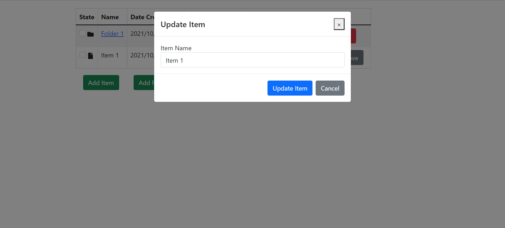
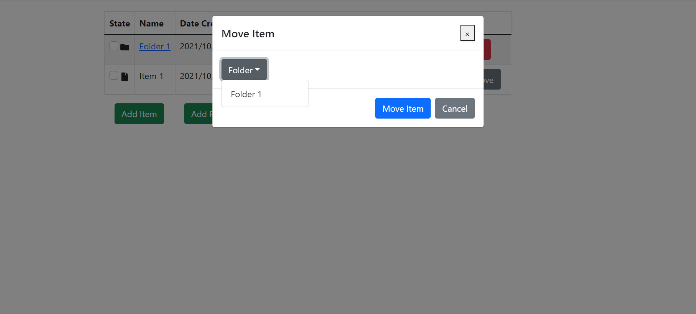
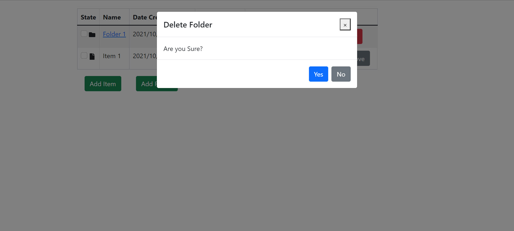

<div id="top"></div>

<br />
<div align="center">
  <a href="https://github.com/Fran2109/ensolvers_exercise.git">
    
  </a>
  <br />
</div>

<details>
  <summary>Table of Contents</summary>
  <ol>
    <li>
      <a href="#about-the-exercise">About The Exercise</a>
      <ul>
        <li><a href="#built-with">Built With</a></li>
      </ul>
    </li>
    <li>
      <a href="#getting-started">Getting Started</a>
      <ul>
        <li><a href="#prerequisites">Prerequisites</a></li>
        <li><a href="#front-end">Front-End</a></li>
        <li><a href="#back-end">Back-End</a></li>
      </ul>
    </li>
    <li>
      <a href="#usage">Usage</a>
      <ul>
        <li><a href="#item">Item</a></li>
        <li><a href="#folder">Folder</a></li>
      </ul>
    </li>
    <li><a href="#contact">Contact</a></li>
  </ol>
</details>

## About The Exercise

<p align="left">Implement a simple web application that allows you to create to-do items and folders to
group them. The development is divided in two phases:<br/>
- Phase 1: to-do item creation<br/>
- Phase 2: folder creation to group the to-do items<br/></p>

<p align="right">(<a href="#top">back to top</a>)</p>

### Built With

* [React.js](https://reactjs.org/) v-17.0.2
* [Node.js](https://nodejs.org/) v-16.3.0
* [MongoDB](https://www.mongodb.com) v-5.0.3
* [Axios](https://axios-http.com/) v-0.23.0
* [Reactstrap](https://reactstrap.github.io/) v-8.10.0
* [Sweetalert2](https://sweetalert2.github.io/) v-11.1.9

<p align="right">(<a href="#top">back to top</a>)</p>

## Getting Started

In order to run and properly test the functionality of the system you must install.
* [Node.js](https://nodejs.org/)
* [MongoDB](https://www.mongodb.com)

## Prerequisites

### Front-End
Once we have the two applications installed we will proceed to open a terminal in Visual Studio Code.<br/>
1. We will run the following command in the terminal and wait for it to finish
* npm
  ```sh
  npm install npm@latest -g
  ```
2. Once we have the last version of Node we will install all the dependencies of the Front-End
* npm
  ```sh
  npm install
  ```
3. After that we will run the npm start command
* npm
  ```sh
  npm start
  ```
<p align="right">(<a href="#top">back to top</a>)</p>

### Back-End
When we have the Front-End running, we will go to prepare the Back-End in a new terminal without closing the previous one.
1. We will go from the root directory to the backend folder whit the following command in the terminal.
* npm
  ```sh
  cd backend
  ```
2. Once there we will run the next command in order to install all necessary dependencies to run our Back-End Database and Server.
* npm
  ```sh
  npm install
  ```
3. Now we will run the next command to start MongoDB.
* npm
  ```sh
  mongod
  ```
4. Also, open another terminal and run the following command to start the Nodemon server by staying in the Back-End folder.
* npm
  ```sh
  nodemon server.js
  ```

<!-- USAGE EXAMPLES -->
## Usage
At start the App will look like this:

This is beacuse the Database is empty and and there is no record or table.<br/>
There are two options at the beginning:

* Add Item
* Add Folder

<p>For each option you can click on it and a modal like these will appear.</p>



<br/>

<p>I have created one work item and one folder like in the picture.</p>

<br/>


<p>There are three different options per item and two options per folder.</p>

### Item
* Update
* Delete
* Move

<p>The Update Option will allow you to change the name of the item and it will automatically set the last date that this item has been updated.</p>

<p>The Delete Option will allow you to delete permanently the item.</p>

<p>The move option will allow you to move the item to any folder you have already created.</p>

<p>There´s also a checkbox that marks whether the item is already completed.</p>

### Folder
* Update
* Delete

<p>The Update Option will allow you to change the name of the folder and it will automatically set the last date that this folder has been updated.</p>

<p>The Delete option will allow you to permanently delete the folder, including all work items stored within.</p>

<p>There is also a checkbox that marks if the folder is already full. If the folder is checked, all interior work items will also be checked</p>

<p>If you click in the folder name you will be able to see all the work items that are inside this folder.</p>
<p align="right">(<a href="#top">back to top</a>)</p>


## Contact

[Linkedin](https://github.com/Fran2109/ensolvers_exercise.git)

Project Link: [https://github.com/Fran2109/ensolvers_exercise.git](https://github.com/Fran2109/ensolvers_exercise.git)

<p align="right">(<a href="#top">back to top</a>)</p>