<div id="top"></div>

<br />
<div align="center">
  
  <br />
</div>

<details>
  <summary>Table of Contents</summary>
  <ol>
    <li>
      <a href="#about-the-exercise">About The Exercise</a>
      <ul>
        <li><a href="#built-with">Built With</a></li>
      </ul>
    </li>
    <li>
      <a href="#getting-started">Getting Started</a>
      <ul>
        <li><a href="#prerequisites">Prerequisites</a></li>
        <li><a href="#front-end">Front-End</a></li>
        <li><a href="#back-end">Back-End</a></li>
      </ul>
    </li>
    <li>
      <a href="#usage">Usage</a>
      <ul>
        <li>
            <a href="#notes">Notes</a>
            <ul>
                <li><a href="#create">Create</a></li>
                <li><a href="#read">Read</a></li>
                <li><a href="#update">Update</a></li>
                <li><a href="#delete">Delete</a></li>
                <li><a href="#archive">Archive</a></li>
            </ul>
        </li>
      </ul>
    </li>
  </ol>
</details>

## About The Exercise

<p align="left">You need to implement a simple web application that allows you to take notes, tag and filter them. The development is divided in two phases:<br/>
- Phase 1: note creation<br/>
- Phase 2: tag application and filtering<br/></p>

<p align="right">(<a href="#top">back to top</a>)</p>

### Built With

#### Backend
* [@faker-js/faker](https://fakerjs.dev/) v-7.4.0
* [body-parser](http://expressjs.com/en/resources/middleware/body-parser.html) v-1.20.0
* [cluster](https://nodejs.org/api/cluster.html) v-0.7.7
* [cookie-parser](https://www.npmjs.com/package/cookie-parser) v-1.4.6
* [cors](https://www.npmjs.com/package/cors) v-2.8.5
* [dotenv](https://www.npmjs.com/package/dotenv) v-16.0.1
* [express](http://expressjs.com/es/) v-4.18.1
* [faker](https://fakerjs.dev/) v-6.6.6
* [jsonwebtoken](https://www.npmjs.com/package/jsonwebtoken) v-8.5.1
* [knex](https://knexjs.org/) v-2.2.0
* [mongoose](https://mongoosejs.com/) v-6.5.2
* [mysql](https://www.npmjs.com/package/mysql) v-2.18.1
* [nodemon](https://nodemon.io/) v-2.0.19
* [os](https://nodejs.org/api/os.html) v-0.1.2
* [passport](https://www.passportjs.org/) v-0.6.0
* [passport-jwt](passport-jwt) v-4.0.0
* [passport-local](https://www.passportjs.org/packages/passport-local/) v-1.0.0
* [passport-local-mongoose](https://github.com/saintedlama/passport-local-mongoose#readme) v-7.1.2
* [socket.io](https://socket.io/) v-4.5.1
* [yargs](http://yargs.js.org/) v-17.5.1

#### Frontend
* [@mui/material](https://mui.com/) v-5.10.0
* [axios](https://axios-http.com/docs/intro) v-0.27.2
* [bootstrap](https://getbootstrap.com/) v-5.2.0
* [react](https://es.reactjs.org/) v-18.2.0
* [react-dom](https://es.reactjs.org/docs/react-dom.html) v-18.2.0
* [react-icons](https://react-icons.github.io/react-icons/) v-4.4.0
* [react-router-dom](https://v5.reactrouter.com/web/guides/quick-start) v-6.3.0
* [reactstrap](https://reactstrap.github.io/) v-9.1.3
* [socket.io-client](https://www.npmjs.com/package/socket.io-client) v-4.5.1
* [sweetalert2](https://sweetalert2.github.io/) v-11.4.26

<p align="right">(<a href="#top">back to top</a>)</p>

### Deploy
This app is deployed in heroku and is accesible clicking [here](https://frontend-ensolvers-filosi.herokuapp.com/)
## Getting Started

In order to run and properly test the functionality of the system you must install.
* [Node.js](https://nodejs.org/)

## Prerequisites

### Back-End
Once we have Node installed we will proceed to open a terminal in Visual Studio Code.<br/>
1. We will open a terminal in the Back-End forler an run
```sh
npm install
```
2. After that we will run the npm start command in order to start the aplication in production
```sh
npm run cluster
```
<p align="right">(<a href="#top">back to top</a>)</p>

### Front-End
When we have the Back-End running, we will go to prepare the Front-End in a new terminal without closing the previous one.
1. We will go from the root directory to the frontend folder whith the following command in the terminal.
```sh
npm install
```
2. And then we will run the next command to start the front-end
```sh
npm start
```

<!-- USAGE EXAMPLES -->
## Usage
At start the App will look like this:
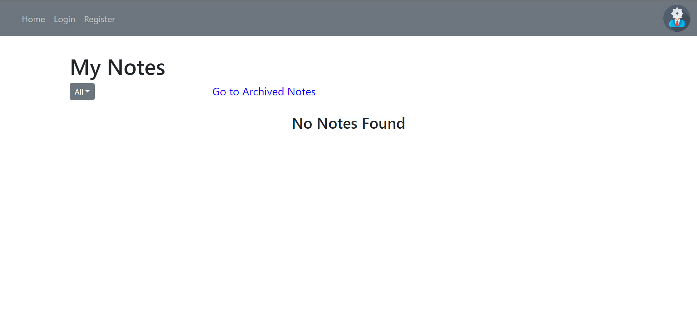
There are two options at the beginning:

* Continue Unlogged
* Continue Logged


If you want to continue unlogged you won't be able to create, delete and update any note or create a category<br>
If you don't have an account you can create one going to Register<br>
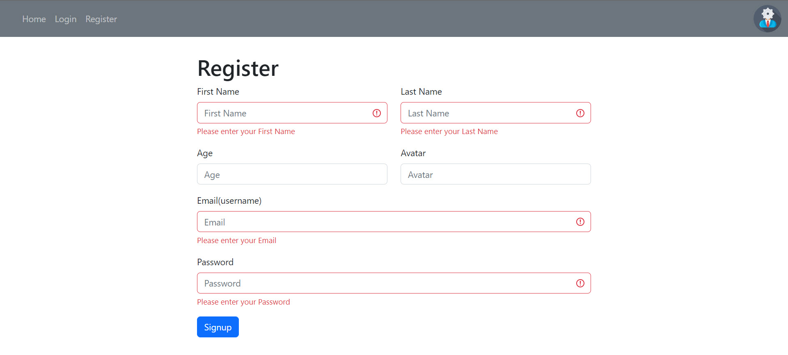
You can create an account as long as you don´t reuse the same Email<br>
Once we are logged in the page will look like this<br>
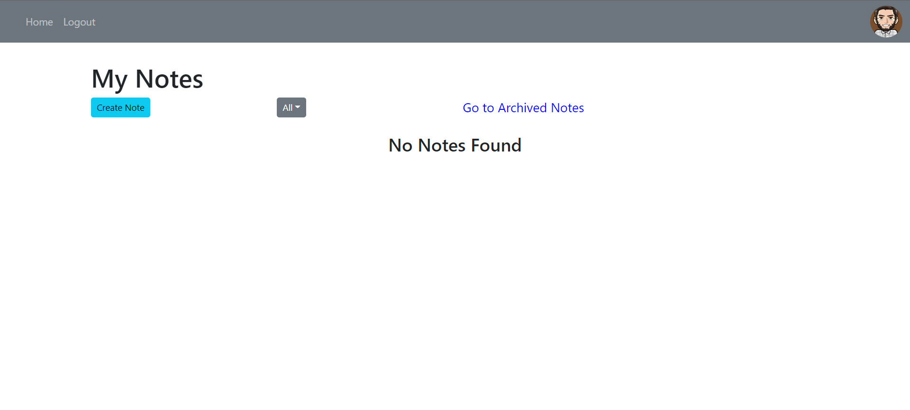
**NOTE**: now we can see the button in order to create a note.<br>

### Notes
#### Create
When we click in the button it will appear a screen like this one<br>
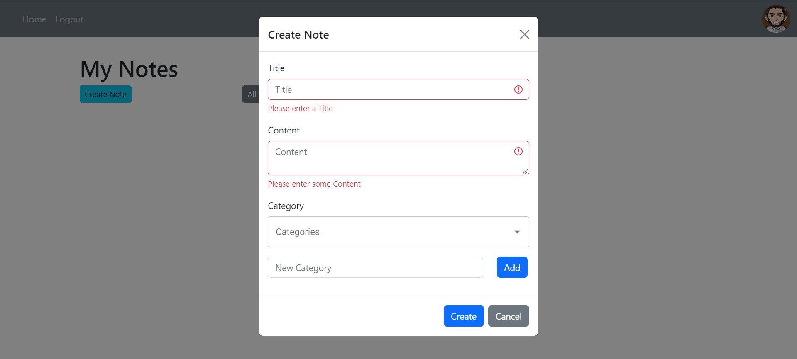
The Title, Content and Category are mandatory to be filled.<br>
There must be at least one Category selected.<br>
If we need, we can create a new category in the label of New Category.<br>
Once created it will apear in the combobox.<br>
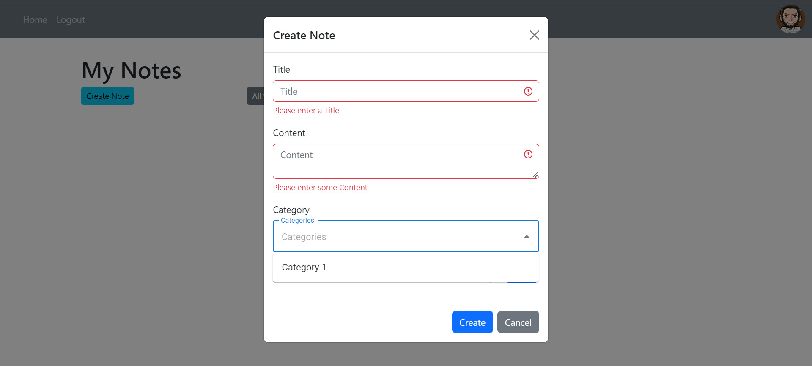
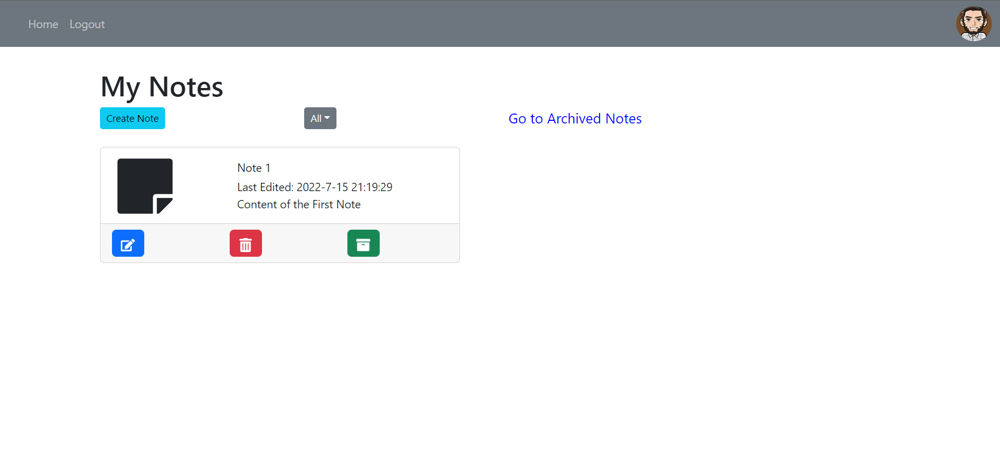
Now we will create more notes in order to test the next funcionalities.<br>

#### Read
At first will appear all the notes and we can start to filter by category
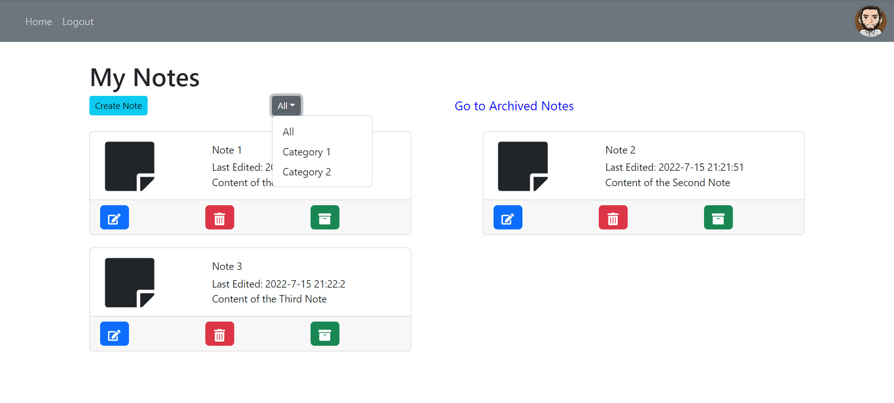

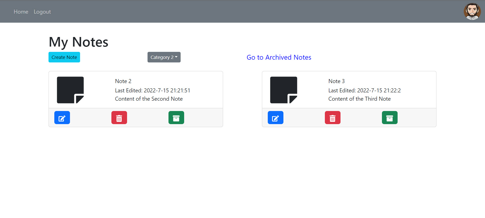

#### Update
Now we can start to update the notes by clicking the blue button<br>

Here we have the info of the second note.
We will remove one category and change the title.
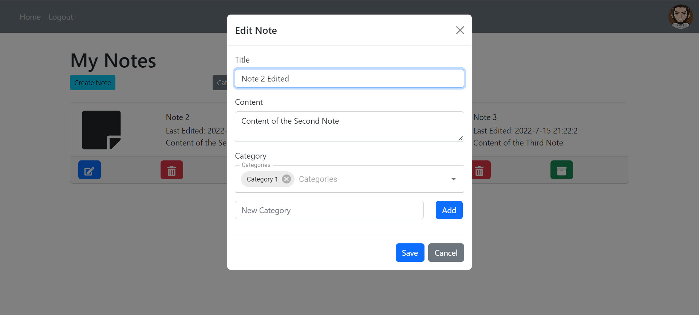
Now the note don't appear in the Category 2 filter

But it appears in the Category 1 Filter.
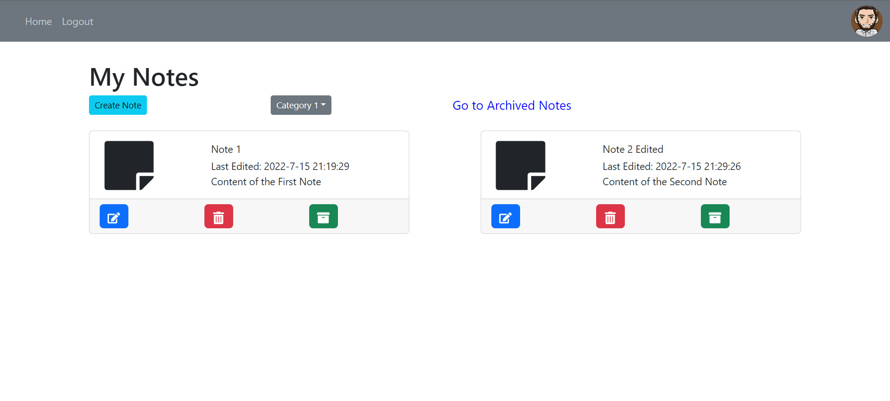

### Delete
We can delete a note by clicking in the red button.
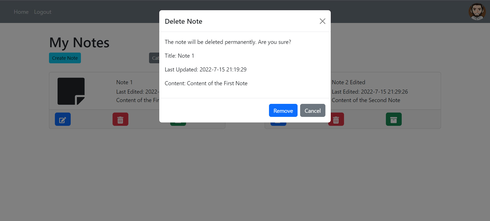
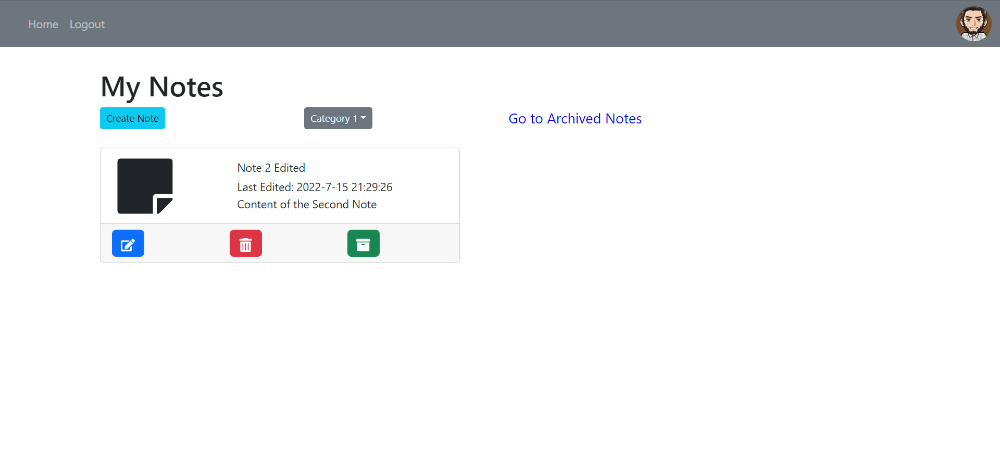

### Archive
We can click in go to archived notes to see the archived notes and click in the green button to archive or unarchive a note. As an example I have archived the Note 2<br>

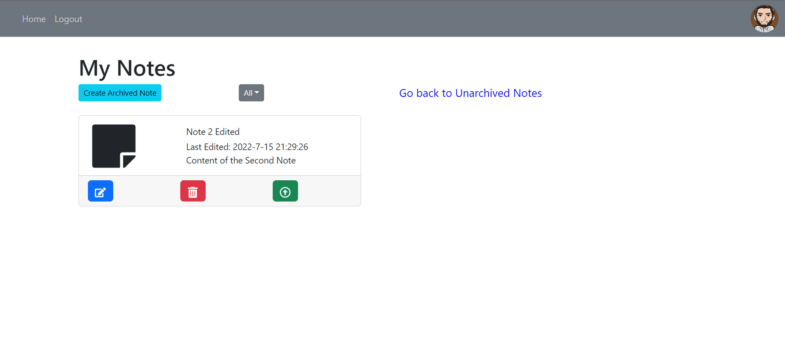

